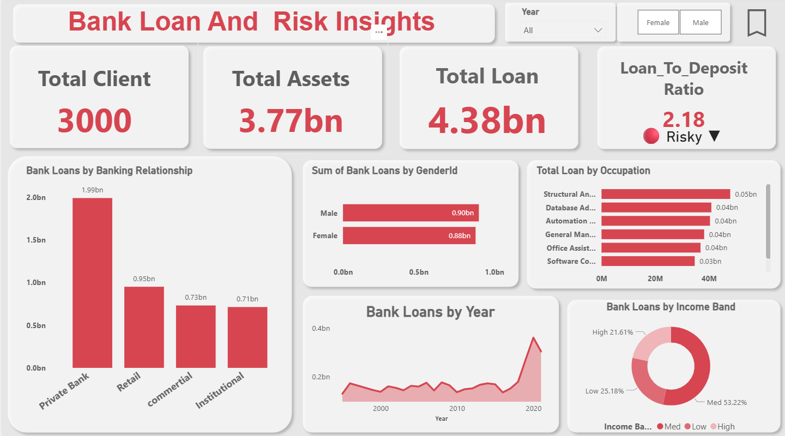
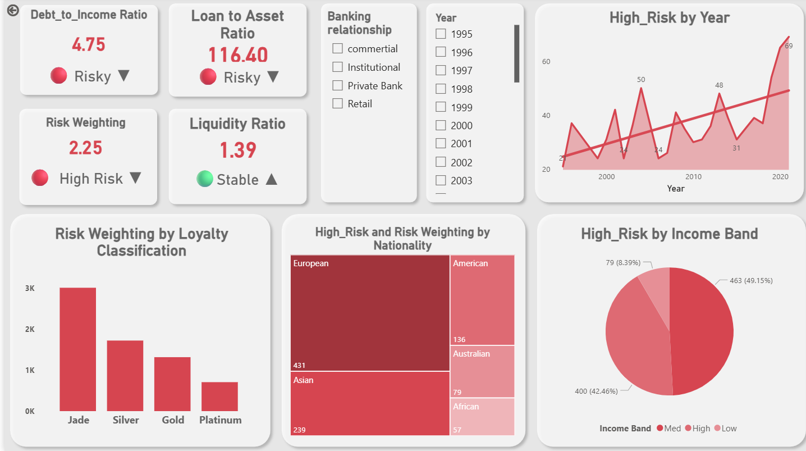

# 🏦 Bank Loan Risk Analysis Dashboard

## 📋 Table of Contents
- [Project Overview](#-project-overview)
- [Problem Statement](#-problem-statement)
- [Tools & Technologies](#️-tools--technologies)
- [Dataset Features](#-dataset-features)
- [Dashboard Highlights](#-dashboard-highlights)
- [Key Insights](#-key-insights)
- [Dashboard Preview](#-dashboard-preview)
- [Project Structure](#-project-structure)
- [Business Impact](#-business-impact)
- [Future Improvements](#-future-improvements)
- [Author](#author)
---

## 📌 Project Overview
This project analyzes a bank’s loan portfolio to identify high-risk customer segments, monitor financial health, and support credit decision-making using an interactive Power BI dashboard.

The dashboard transforms raw banking data into actionable insights for **risk managers, credit analysts, and business stakeholders**.

---

## 🎯 Problem Statement
Banks often face challenges in balancing **loan growth** with **credit risk management**.

This project helps answer:
- Which customer segments carry the highest risk?
- How is portfolio risk changing over time?
- Are financial ratios within healthy thresholds?
- Where should stricter lending policies be applied?

---

## 🛠️ Tools & Technologies
- **Power BI** – Dashboard development & visualization
- **Excel** – Data cleaning and preprocessing
- **DAX** – KPI calculations and measures
- **Banking Domain Analytics** – Risk analysis framework

---

## 📂 Dataset Features
The dataset includes:
- Client demographics (Gender, Nationality, Income Band)
- Banking relationship details
- Loan amount and deposits
- Debt-to-Income Ratio
- Loan-to-Asset Ratio
- Liquidity Ratio
- Loyalty Classification
- Risk indicators (High Risk flag)
- Historical banking trends

---

## 📊 Dashboard Highlights
✔ **2,940 Clients** analyzed  
✔ **4.38bn Total Loans** issued  
✔ **3.77bn Total Assets** monitored  
✔ **0.88 Loan-to-Deposit Ratio** (Healthy)  
✔ **4.75 Debt-to-Income Ratio** (High Risk)  
✔ **1.39 Liquidity Ratio** (Strong)  

---

## 🔍 Key Insights
- **Medium-income clients** contribute the highest risk (**49%**)
- **European clients** have the largest high-risk concentration (**431 clients**)
- **Private banks** issued the highest loan volume
- **High-risk accounts increased steadily over time**
- **Jade customers** show the highest risk weighting

---

## 📈 Dashboard Preview

### Portfolio Overview


### Risk Analysis


---

## 📁 Project Structure
```text
bank-loan-risk-analysis/
│── data/
│   └── bank_risk_data.csv
│── dashboard/
│   └── Bank_Loan_Risk_Analysis.pbix
│── images/
│   ├── Loan Analysis paged.png
│   └── Risk Analysis page.png
│── README.md
```

---

## 🚀 Business Impact
This dashboard helps banks:
- Monitor portfolio risk in real time
- Identify high-risk customer segments
- Improve lending strategy
- Reduce default risk
- Support smarter credit decisions

---

## 🚀 Future Improvements
- Add predictive risk scoring using Machine Learning
- Enable real-time banking data integration
- Create branch-level drill-through analysis
- Build loan default forecasting models

---

## Author
**Bhagyashree Magar**  
Aspiring Data Analyst | SQL | Python | Power BI | Excel  

📧 Email: magarbhagyashree26@gmail.com  
🔗 LinkedIn: [Bhagyashree Magar](https://www.linkedin.com/in/bhagyashree-magar/)  
🔗 GitHub: [BhagyashreeMagar](https://github.com/BhagyashreeMagar)
